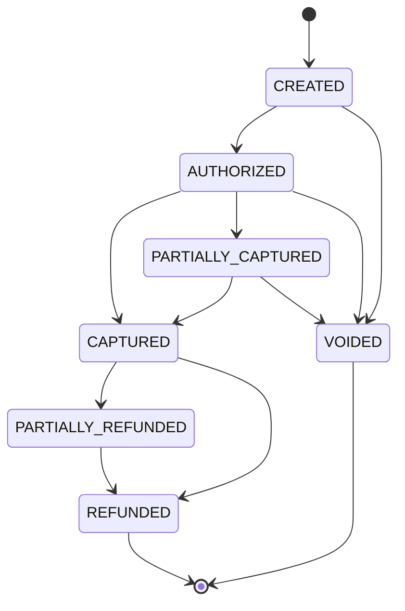
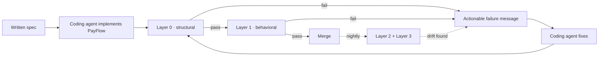

# PayFlow

A payment system built by an AI coding agent, and the checks designed to catch its mistakes.

An AI agent implemented PayFlow, a payment intent processor over a double entry ledger, from a frozen spec. No human reads every line before it ships. Instead, four automatic checks stand in for that review, each one catching a class of mistake the other three would miss. The headline result: a **72.7% mutation kill rate on the payment core with zero hand written test cases**, every property discovered by an agent and every counterexample found by Hypothesis.

> **New here?** The five minute version is the interactive walkthrough: [`site/index.html`](site/index.html). It has a plain language mode and a technical mode, and every scenario is a real failure from this repo. Once the repo is pushed, that page is served through GitHub Pages from the `site/` directory.

## Run it

Requires Python >=3.12 and [uv](https://docs.astral.sh/uv/).

```bash
uv sync                 # install deps
uv run demo             # the fast gates (Layers 0 and 1), one colored screen
uv run pytest tests/    # the full replay slice
uv run lint-imports     # the Layer 0 architectural gate on its own
```

The property generation agent (`uv run agent-run`) needs `OPENAI_API_KEY` in `.env` and costs a few cents per run; add `--offline` for a free deterministic pass. The full command list, per layer, is in [`AGENTS.md`](AGENTS.md).

## Where the human fits in

A person is not the default reviewer. The loop is built so that a human is the escalation path, pulled in only when:

- a check cannot confidently tell a real problem from a false alarm, so triage escalates the failure as `needs_human`, or
- a change would need a rule nobody has written down yet, which is a spec decision recorded in a new ADR.

Everything else is handled by the checks and the coding agent that reacts to them. Failure messages are written for that agent to act on: the violated rule, the shrunk counterexample, or the exact offending import.

## The system, at a glance

A payment intent moves through seven states. Money is integer minor units, never a float. There is no dispute or chargeback flow in v1 (cut in [ADR-0001](docs/adr/0001-foundational-decisions.md)).



`VOIDED` and `REFUNDED` are terminal: any further operation returns `409` and changes nothing.

## How a change gets checked



Layers 0 and 1 run on every commit and block a merge. Layers 2 and 3 run in a nightly lane and warn for now. Any failure sends the loop back to the coding agent, which fixes it and runs the checks again from the start.

## The four checks, briefly

0. **Structural (`import-linter`).** Is the agent's code even in the right place? A static contract enforces `api → domain → infrastructure` and a single writer to the ledger tables.
   *Once caught: an admin route the agent wired straight into the ledger, bypassing all domain validation. `uv run lint-imports` reported `2 kept, 1 broken` and blocked it. Reproduce it with [`tools/seeded_bugs/activate_fm_b.sh`](tools/seeded_bugs/activate_fm_b.sh).*

1. **Behavioral (Hypothesis).** Does PayFlow behave the way the spec says, across many generated situations rather than one example? Agent discovered invariants (INV-1..7) and metamorphic relations are replayed against the implementation.
   *Once caught: a race no sequential test can express. Under `fm_a`, sixteen threads sending one idempotency key produced up to six duplicate captures, while the sequential replay stayed green.*

2. **Agent judgment (AGENT-MR).** Can you trust the verifier's own verdicts? This layer tests the triage agent, not PayFlow: reword a failure without changing its data and the verdict should not move.
   *Once caught: a fee misroute verdict flipped from `real_bug` to `bad_relation` on a single reword, while reordering and padding never moved it. The fragility is specifically lexical.*

3. **Mutation ground truth (`mutmut`).** Is the suite actually checking anything, or just running? A mutation pass breaks the code in small ways and asks whether any test notices.
   *Once caught: a refund path the suite never reached. 62 of 181 survivors clustered in `service.refund` with zero refunds ever exercised. Closing that loop through discovery moved the kill rate from a 65.3% floor to the low seventies.*

## Results

- **72.7% mutation kill rate** on the payment core, up from a 65.3% floor, with **zero hand written test cases**.
- **2 checks block a merge, 2 warn first.** Layers 0 and 1 gate the PR lane; Layers 2 and 3 run nightly, warn only until baselined.
- **PR lane under 3 minutes** (the fast gates run in about seven seconds locally).
- **About $0.45 total LLM spend** for the whole build.

The zero hand written tests claim has one honest asterisk: a hand written Phase 1 sanity machine does exist, but it adds only 2 extra kills over the agent suite (73.1% full versus 72.7% agent only), so the headline number stands essentially on the agent's work alone.

Status: all four layers are built. Layers 0 and 1 are CI gated; Layers 2 and 3 are built and baselined, warn only until stable. Live numbers are in the [trust report](site/trust-report.html), generated from real run artifacts.

## Want the detailed version

- [`site/index.html`](site/index.html) · the interactive walkthrough (start here)
- [`site/trust-report.html`](site/trust-report.html) · live numbers from real runs
- [`docs/design.md`](docs/design.md) · the full design and the written specification the coding agent implements (§5): the pyramid, the property generation agent, the CI contract, the novelty analysis
- [`docs/adr/`](docs/adr/) · decisions of record (ADR-0001 is immutable)

<details>
<summary><b>For the technical reader: what is novel here</b></summary>

Plain "an LLM infers properties and writes Hypothesis tests" is no longer novel; 2025 academic work already does that for single functions. The differentiation is in the columns below. Full analysis with citations lives in [`docs/design.md` §12](docs/design.md#12-novelty--differentiation-summary) and the bibliography in [§16](docs/design.md#16-references).

| Technique | Prior work (2025 to 2026) | This project |
|---|---|---|
| Agentic property based testing | Property inference + Hypothesis codegen + reflection triage, for single functions | Extended to a stateful system with eight endpoints, via a `RuleBasedStateMachine` |
| Agentic model based testing | Static FSM inference from source; OpenAPI driven API test generation | Hypothesis driven exploration of a live system to refine the model |
| Agentic metamorphic testing | Multi agent MR generation from specs; PBT as MT superset established since 2022 | Agent discovered relations fused into the same stateful engine as the invariants, with automated triage instead of a human reviewer |
| Testing the agent itself | Scenario style behavioral simulation of agents is productized | Metamorphic testing applied reflexively to the agent's own triage verdicts (AGENT-MR), not found in the system under test literature |
| Ground truth evaluation | Mutation testing as the standard check on AI generated test quality | Mutation score as the closed loop metric for an agent's autonomously discovered invariants and relations |
| Agentic implement plus verify, one loop | Coding agents from spec, and agentic test generation, each covered separately | A failure message contract (design §10) written so a coding agent is the primary consumer and a human is the escalation path |

</details>

<details>
<summary><b>For the technical reader: repo map and CI</b></summary>

| Path | What lives there |
|---|---|
| [`docs/design.md`](docs/design.md) | Full design plus the written specification (§5): pyramid, agent graph, CI contract, novelty analysis, references |
| [`docs/adr/`](docs/adr/) | Decisions of record (ADR-0001 is immutable) |
| `payflow/`, `agent/`, `tests/` | The system, the property generation agent, and the four layer test suites |
| [`mutation/`](mutation/), [`site/`](site/) | Layer 3 baseline, the trust report, and the interactive walkthrough |

CI: [`.github/workflows/ci.yml`](.github/workflows/ci.yml) is the keyless PR gate (Layers 0 and 1); [`nightly.yml`](.github/workflows/nightly.yml) is the manual deeper lane (discovery, the Layer 2 triage judgment suite, mutation, trust report), which skips the paid lanes honestly without `OPENAI_API_KEY`. No GitHub remote is wired yet, so nothing is pushed.

</details>
