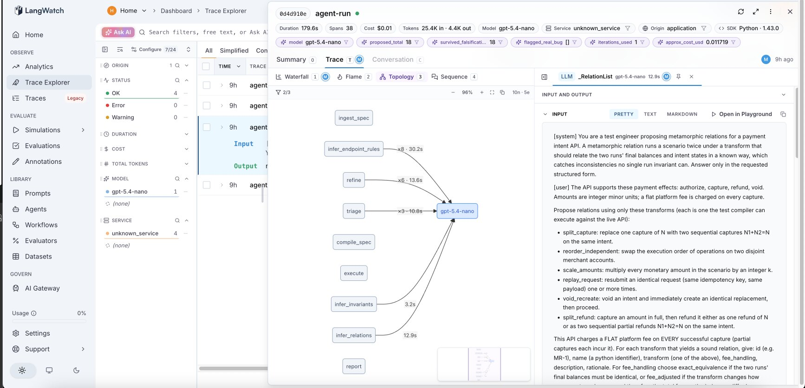
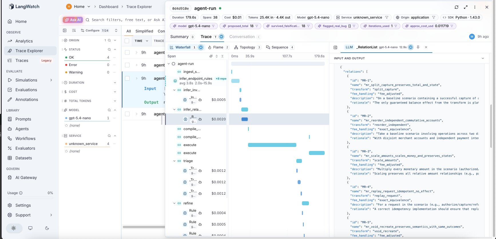

# PayFlow

A payment system built by an AI agent from a frozen spec, guarded by a four layer verification pyramid.

### ▶ [See the interactive walkthrough](https://mariusargatu.github.io/PayFlow/)

The whole project in five minutes: plain language and technical modes, every scenario a real failure from this repo, and the live trust report.

---

An AI agent implemented PayFlow, a payment intent processor over a double entry ledger, from a frozen spec. No human reads every line before it ships. Instead, four automatic checks stand in for that review, each catching a class of mistake the other three miss. Headline result: a **72.7% mutation kill rate on the payment core with zero hand written test cases**: every property discovered by an agent, every counterexample found by Hypothesis. A person is the escalation path, not the default reviewer: pulled in only when triage cannot confidently call a failure (`needs_human`) or a change needs a rule no one has written (a new ADR).

## The loop


Layers 0 and 1 run on every commit and block a merge; Layers 2 and 3 run nightly and warn. Any failure loops back to the coding agent, which fixes it and reruns from the start.

## The four checks

| # | Check | Question | Once caught |
|---|---|---|---|
| 0 | **Structural** (`import-linter`) | Is the code even in the right place? | An admin route wired straight into the ledger, bypassing domain validation. Reproduce: `tools/seeded_bugs/activate_fm_b.sh`. |
| 1 | **Behavioral** (Hypothesis) | Does it behave as the spec says, across many generated cases? | A race no sequential test can express: under `fm_a`, 16 threads on one idempotency key produced duplicate captures while sequential replay stayed green. |
| 2 | **Agent judgment** (AGENT-MR) | Can you trust the verifier's own verdicts? | A verdict flipped `real_bug` → `bad_relation` on a single reword, while reorder and padding never moved it: the judge is lexically fragile. |
| 3 | **Mutation ground truth** (`mutmut`) | Is the suite checking anything, or just running? | A refund path the suite never reached (62 of 181 survivors in `service.refund`); closing the loop through discovery moved the kill rate off its 65.3% floor. |

The agent **proposes** falsifiable checks (rules, invariants, metamorphic relations); a deterministic engine **disposes**, Hypothesis falsifies, the compiler and mutation testing ground truth. The LLM never marks its own homework.

> **The `fm_a` / `fm_b` / `fm_c` names are deliberate bugs.** `PAYFLOW_BUG=fm_a` (and `fm_b`, `fm_c`) swaps a correct implementation for a broken one at startup, so each layer can be shown catching its class of mistake on demand. They are off by default and never set in a real configuration; they exist only to prove the checks work.

## Results

- **72.7% mutation kill rate** on the payment core, up from a 65.3% floor, **zero hand written tests**.
- **2 checks block a merge, 2 warn.** Layers 0/1 gate the PR lane; Layers 2/3 run nightly until baselined.
- **PR lane under 3 minutes** (~7s locally); **~$0.45 total LLM spend** for the whole build.

Honest asterisk: a hand written Phase 1 sanity machine exists but adds only 2 kills over the agent suite (73.1% full vs 72.7% agent only), so the headline stands on the agent's work.

## Observability

Every agent run is traced through OpenTelemetry into a self hosted LangWatch, so the propose and dispose steps are inspectable rather than a black box: each node's timing and cost, the actual prompt sent, and the properties the model proposed back.





## Run it

Requires Python ≥3.12 and [uv](https://docs.astral.sh/uv/).

```bash
uv sync                 # install deps
uv run demo             # the fast gates (Layers 0 and 1), one colored screen
uv run pytest tests/    # the full replay slice
uv run build-report     # regenerate the report folded into site/index.html
```

`uv run agent-run` runs the discovery agent (needs `OPENAI_API_KEY` in `.env`, a few cents; `--offline` is free; `--view` is a live TUI). Full per layer command list: [`AGENTS.md`](AGENTS.md).

<details>
<summary><b>What is novel here</b></summary>

Plain "an LLM infers properties and writes Hypothesis tests" is no longer novel; 2025 work does that for single functions. Full analysis with citations: [`docs/design.md` §12](docs/design.md#12-novelty--differentiation-summary), [§16](docs/design.md#16-references).

| Technique | Prior work (2025 to 2026) | This project |
|---|---|---|
| Agentic property based testing | single function inference + Hypothesis codegen + reflection triage | a stateful system with eight endpoints, via a `RuleBasedStateMachine` |
| Agentic model based testing | static FSM inference; OpenAPI driven test generation | Hypothesis driven exploration of a live system to refine the model |
| Agentic metamorphic testing | multi agent MR generation from specs | agent discovered relations fused into the same stateful engine, with automated triage |
| Testing the agent itself | scenario style behavioral simulation | metamorphic testing applied reflexively to the agent's own triage verdicts (AGENT-MR) |
| Ground truth evaluation | mutation testing as a check on AI generated tests | mutation score as the closed loop metric for autonomously discovered properties |
| Implement + verify, one loop | coding agents and test generation, covered separately | a failure message contract so a coding agent is the primary consumer, a human the escalation path |

</details>

<details>
<summary><b>Repo map and CI</b></summary>

| Path | What lives there |
|---|---|
| [`docs/design.md`](docs/design.md) | Full design + the written specification (§5): pyramid, agent graph, CI contract, novelty, references |
| [`docs/adr/`](docs/adr/) | Decisions of record (ADR-0001 is immutable) |
| `payflow/`, `agent/`, `tests/` | The system, the property generation agent, the four layer suites |
| [`mutation/`](mutation/), [`site/`](site/) | Layer 3 baseline; the single page walkthrough with the trust report folded in |

CI: [`ci.yml`](.github/workflows/ci.yml) is the keyless PR gate (Layers 0/1); [`nightly.yml`](.github/workflows/nightly.yml) is the manual deeper lane (discovery, Layer 2, mutation), skipping paid lanes honestly without `OPENAI_API_KEY`; [`pages.yml`](.github/workflows/pages.yml) publishes `site/` to GitHub Pages.

</details>
