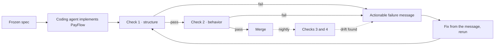

# PayFlow

**An AI agent wrote this payment system from a frozen spec. No human read every line before it shipped. Four automatic checks are what make that safe.**

### ▶ [Watch the five minute walkthrough](https://mariusargatu.github.io/PayFlow/)

Plain language and technical views, every scenario a real failure from this repo, and a trust report where every number is read live from a committed artifact.

---

## The one idea

**The problem:** an AI agent can now implement a whole payment processor from a written spec. The bottleneck was never writing the code, it is *trusting* code that nobody read line by line.

**The solution:** a second, independent agent proposes the safety checks, and a deterministic engine, not the agent, decides whether the code passes. The model never grades its own work.

Everything below is that one idea, at four altitudes.

## The story, in six beats

1. **The problem.** An AI agent implemented PayFlow, a payment intent processor over a double entry ledger, from the frozen contracts in [`specs/`](specs/). The hard part is not the writing, it is trust: nobody read every line, so how do you know the money is safe?
2. **Why it is hard.** You cannot just ask the agent "did you get it right?" A model that can write the bug can write a test that misses it. And the bugs that matter in payments are not typos, they are *orderings*: refunding more than was captured, two threads sharing one idempotency key, a fee that silently goes to the wrong account. No hand picked example test thinks to try them.
3. **The insight.** Split the work. One agent **proposes** falsifiable checks (rules, invariants, cross run relations); a deterministic engine **disposes**, compiling them, running them against thousands of generated payment sequences, and deciding pass or fail. The LLM never marks its own homework.
4. **The architecture.** Four checks stand in for the line by line review, each catching a class the other three miss: is the code even in the right place (structure), does it behave correctly across thousands of sequences (behavior), can you trust the checker's own verdicts (the agent judging itself), and if you deliberately break the code, does any test notice (mutation)?
5. **The proof.** Break the payment core 571 ways and the agent discovered suite catches **73.1%** of the mutants it covers, with zero hand written test cases. A hand written expert test machine, run alongside, adds **zero** further kills, so the headline stands entirely on the agent's own work.
6. **The honest limits.** About 27% of mutants survive. Four of the twelve frozen rules still have no check. The checker can be fooled by a reword, so it votes three times and escalates ties. Only two of the four checks block a merge. This is an existence proof of a method on one small system, not a finished SDLC, and it says so, with numbers, next to every claim. See [What this does not prove](#what-this-does-not-prove).

## Proof you can run: change the spec, and the gate stops you

The whole safety argument is one claim: **you cannot change the frozen spec without the pipeline noticing.** So we tested it. We added a single new invariant to `specs/invariants.md` and changed nothing else:

> INV-8: the sum of a merchant's captured amounts never exceeds its lifetime authorized total

The next run of the blocking suite (`uv run pytest tests/`) went red at once, on a gate that blocks the merge:

```
spec_coverage.json invariant inventory drifted from specs/invariants.md:
frozen but uninventoried ['INV-8']
```

That is the point, made concrete. A human moved the contract, and the pipeline refused the build until the new rule is *accounted for*: listed in the coverage inventory and given a real oracle in the agent discovered suite. The agent re derives its checks from the running implementation, and this gate is what forces the human authored spec and the agent discovered suite to stay in lockstep instead of drifting apart. A spec change becomes a deliberate, visible event, never a silent one. We then reverted INV-8, because it was a demonstration, not a real rule.

The same gate guards the other direction. If a fresh discovery run silently drops an oracle it used to carry, "covered stays covered" turns the build red too. A real regeneration recently did exactly that (it dropped the non negativity oracle) and, in doing so, exposed a blind spot in this very gate. The gate was strengthened to anchor on the oracle's own assertion, so it now catches that case as well. The discipline is self correcting: the mechanism that guards the spec also gets audited, and improved, by being run.

## The loop



Checks 1 and 2 run on every commit and block a merge; checks 3 and 4 run nightly and warn. Every failure is written to be *actioned by a coding agent*: the exact rule violated, the shrunk counterexample, or the offending import, not a stack trace to decode. A person still drives the loop today (owns the merge, applies each fix); the fully unattended catch, fix, verify cycle is the design intent, not something this repo claims to have run.

## The four checks

Each one falsifies a different claim about the code.

| # | Check | Question it answers | A bug it caught here |
|---|---|---|---|
| 1 | **Structure** (`import-linter`) | Is the code even in the right place? | An admin route wired straight into the ledger, bypassing domain validation. Reproduce: `uv run catch`. |
| 2 | **Behavior** (Hypothesis) | Does it behave the way the spec says, across many generated sequences? | A race no sequential test can express: 16 threads on one idempotency key produced duplicate captures while sequential replay stayed green. |
| 3 | **The checker itself** (AGENT-MR) | Can you trust the verifier's own verdicts? | A verdict flipped `real_bug` to `bad_relation` on a single reword, while reorder and padding never moved it: the judge is lexically fragile, so triage now votes three times. |
| 4 | **Mutation** (`mutmut`) | Is the suite actually checking anything, or just running green? | A refund path the suite never reached; closing the loop through discovery moved the kill rate off its floor to the 73.1% below. |

Jargon, once: an **invariant** is a fact that must always hold (never capture more than was authorized). A **metamorphic relation** checks that two routes to the same result match (charging 100 once must equal 50 then 50), which catches bugs no single run can see. **Hypothesis** generates thousands of random operation sequences and shrinks any failure to a minimal reproduction. **Mutation kill rate** is the fraction of deliberately injected bugs the suite notices.

Alongside the four checks, an informational **semantic explorer** sends a different model family in as an adversary to inject realistic domain bugs `mutmut` cannot express, then maps each survivor to the frozen spec. It never gates; a survivor is a candidate gap a human confirms. It is how the missing conservation and non negativity oracles were found and then closed.

## Results

- **73.1% mutation kill rate** on the payment core (385 of 527 covered mutants killed, 142 survive, 44 never covered), zero hand written test cases. The agent discovered suite matches the full local suite exactly: the hand written sanity machine adds no kills the agent's own rules do not already make.
- **Four checks: two block a merge, two warn nightly.** Structure and behavior gate every PR; the checker and mutation checks run nightly until baselined.
- **The discovered suite fully asserts 6 of the 12 frozen rules** (up from 4, after two were closed through the loop); 4 still have no oracle, tracked openly. A drift gate fails the build if that coverage silently regresses.
- **Blocking checks run in well under 3 minutes** (about ten seconds locally on the fast gate set). Total LLM spend for the whole build is roughly $0.45, estimated from the committed run reports and dominated by the one time judge selection experiment.

## What this does not prove

The checks confirm the implementation **conforms to a frozen, human authored spec**; they cannot prove the spec itself is correct or complete. Measured in this repo, not hand waved:

- **About 27% of mutants survive** on the payment core. 73.1% is the honest number, not a target that was hit.
- **Four of the twelve frozen rules still have no oracle** in the discovered suite (INV-7 reconciliation, the `amount < 1` and `capture <= fee` boundaries, and cross endpoint idempotency). A drift gate (`tests/drift/test_spec_coverage.py`) fails the build if coverage regresses: a regenerated spec may only strengthen it.
- **The triage judge is lexically fragile** and can raise a false positive against correct code. The trust report reports that false positive rate beside the catch rate, and triage ships a three vote majority with escalation on a split, because a gate that cries wolf trains the human to ignore it.
- **Only two of the four checks block a PR.** The other two run nightly and warn until a real baseline exists to gate against.
- **It is one eight endpoint system**, deliberately small so the invariants are real money and every property is precisely testable.
- **The checks are authored by the same party they check.** The deterministic mechanisms (layering, shrinking, mutation) cannot be talked out of a verdict, but *what* gets checked is agent proposed and human accepted. A held out, independently authored control arm is the honest next step.

## Run it

Requires Python 3.12 or newer and [uv](https://docs.astral.sh/uv/).

```bash
uv sync                 # install deps
uv run demo             # the blocking checks, one colored screen (all green)
uv run catch            # the payoff: seed three bugs, watch a check catch each in red
uv run pytest tests/    # the full replay slice
uv run build-report     # regenerate the trust report folded into site/index.html
```

`uv run agent-run` runs the discovery agent (needs `OPENAI_API_KEY` in `.env`, a few cents; without a key it prints a message and skips; `--view` is a live TUI). `uv run full` runs the whole pyramid end to end. The full per check command list is in [`AGENTS.md`](AGENTS.md).

## Go deeper

- [`docs/design.md`](docs/design.md): the full pipeline design, the agent graph, the CI contract, and the novelty analysis against 2025 to 2026 prior work.
- [`specs/`](specs/): the frozen contracts PayFlow is built against (domain, api, state machine, invariants, constraints).
- [`docs/adr/`](docs/adr/): decisions of record (ADR-0001 is immutable).
- Every agent run is traced through OpenTelemetry into a locally hosted LangWatch, so the propose and dispose steps are inspectable rather than a black box ([trace topology](docs/langwatch-trace-topology.jpg), [span waterfall](docs/langwatch-trace-waterfall.jpg)).
