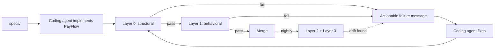
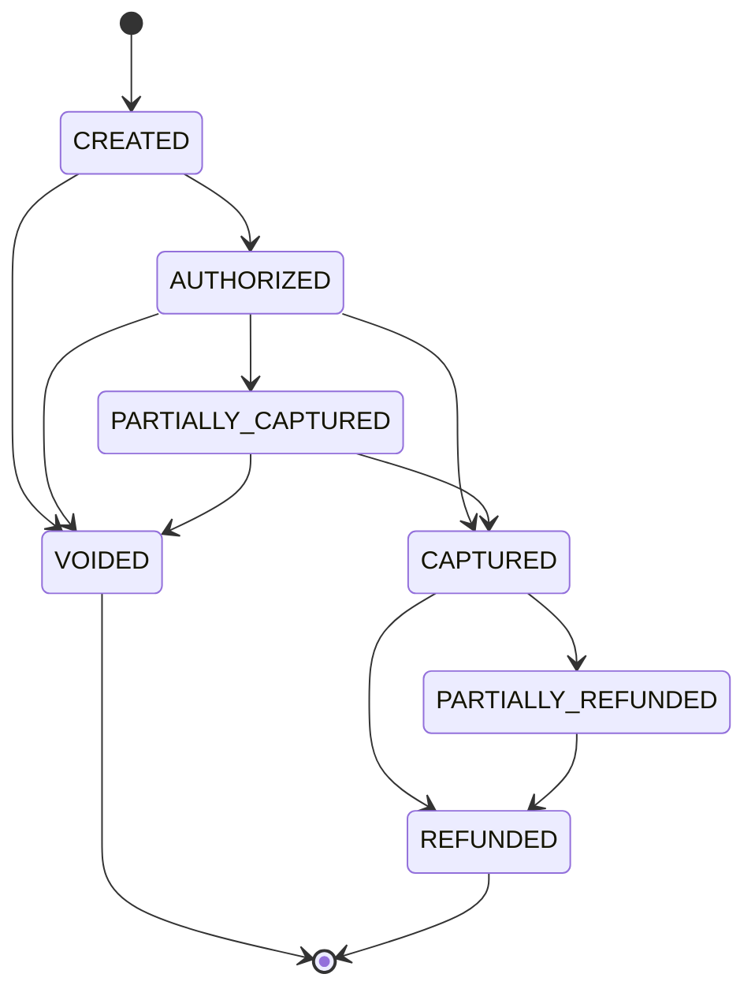
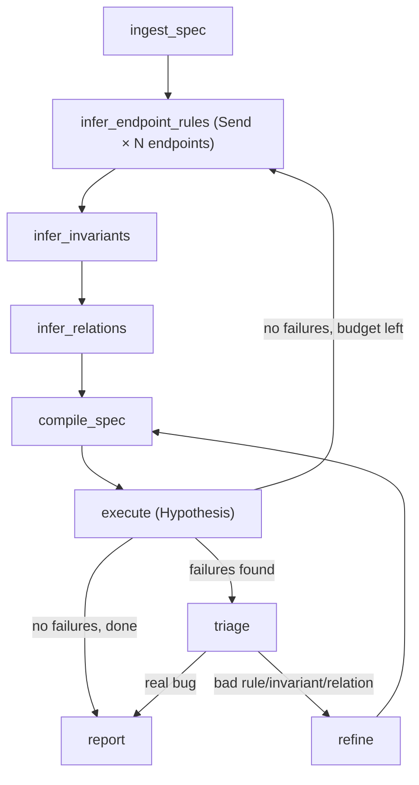

# Agentic Formal Property Generation for a Payment System: Design Doc

**Status:** v3: scope decisions resolved (2026-07-01, recorded in [ADR-0001](adr/0001-foundational-decisions.md)): multi currency (old MR-4) and the `DISPUTED` state are cut from v1; fees stay; the idempotency concurrency harness moves into v1; most §15 `OPEN` items are now decided inline. v2 folded in verification loop patterns, plus the agentic SDLC framing that extends the project from "agent tests a system" to "agent implements and tests a system, safely."
**This is the pipeline design doc, not the system specification.** The system specification lives in [`specs/`](../specs/README.md): frozen contracts (domain, api, state machine, invariants, constraints) that change only through an ADR, and the single source of truth for PayFlow's behavior. Where the two disagree, `specs/` wins for PayFlow behavior; this document wins for pipeline architecture.
**Working names:** `PayFlow` for the system under test; "the agent" for the property generation agent; "the coding agent" for whichever tool (e.g. Claude Code) implements PayFlow itself.

---

## 1. TL;DR

This is not just a testing agent demo; it is a demonstration of a **trustworthy agentic SDLC**: a development loop where AI coding agents do the implementation, and a matching, equally agentic verification architecture is what makes that safe with minimal human supervision. Same philosophy end to end: an agent proposes (code, properties, relations), a deterministic engine or gate disposes (Hypothesis, mutation testing, import-linter, CI).

- **The loop:** a coding agent implements `PayFlow` from `specs/` → a four layer gate (structural, behavioral, agent judgment, mutation ground truth) checks it → failures produce feedback structured for a *coding agent* to act on, not only a human → gate again → merge.
- **System under test:** `PayFlow`, a payment intent processor over a double entry ledger: real state machine, real algebraic invariants, real high stakes failure modes (idempotency).
- **Core mechanism:** Hypothesis's `RuleBasedStateMachine` unifies model based, property based, and (per research, §9) metamorphic testing (checking that a known relationship between two runs holds, when the single right answer is unknowable; defined in §8.1) in one engine; the agent authors the spec, Hypothesis falsifies it.
- **Four layer trust pyramid (§6):** Layer 0 structural/architectural conformance → Layer 1 Hypothesis validates PayFlow's behavior → Layer 2 Scenario + self referential metamorphic testing validates the *verification agent's own judgment* → Layer 3 mutation testing validates that Layer 1 is catching anything real.
- **Agent framework:** LangGraph. **Observability/eval:** LangWatch + `langwatch-scenario`. **Ground truth:** `mutmut`. **Structural gate:** `import-linter`.

---

## 2. Project summary

Most "AI + testing" demonstrations show an agent generating example based unit tests from a diff. That pattern is now built into every major IDE and is not interesting on its own. What *is* interesting is test engineering judgment encoded into an agent, and, one level up, judgment about *how to structure an entire delivery pipeline* so that AI implemented code can be trusted without a human reading every line.

The reframe that drives the whole design, now applied twice, once to testing and once to implementation: **the agent's job is not "write the thing," it's "produce something falsifiable that a deterministic system can check."** For the property generation agent, that means authoring rules/invariants/relations instead of test cases. For the coding agent implementing PayFlow, that means producing code that a structural linter, a property engine, and a mutation testing pass can all independently interrogate, not code a human has to trust because an agent said it was done.

## 3. Why this, not generic "AI writes tests"

Landscape research (full bibliography in §16) confirms plain "LLM infers properties, writes Hypothesis tests" is no longer novel on its own: 2025 academic work already does close to exactly that for single Python functions. This project's differentiation is threefold, detailed fully in §12:

1. Extending property/model inference to a **stateful, multi endpoint system**, not a single function.
2. **Fusing** property based, model based, and metamorphic testing into one engine and one agent pipeline, instead of three separate toolchains.
3. Turning the technique **reflexively on the agent itself**, and now also **backward onto implementation**: the same trust problem, solved the same way, one stage earlier in the pipeline.

## 4. The agentic SDLC loop

The premise: when coding agents are the primary implementers, the bottleneck isn't writing code; agents do that fast. The bottleneck is *trusting* what they wrote without reading every line. That's a specification verification problem, and it's the same problem this project already solves for testing, just extended one step earlier to cover implementation too.



1. **Spec.** A human writes the `specs/` contracts for PayFlow: domain, entities, state machine, invariants, and explicit constraints the coding agent must not invent (§5).
2. **Implement.** A coding agent (Claude Code or equivalent) implements PayFlow from `specs/`. The initial generation is committed separately and tagged as agent generated, so provenance is always traceable.
3. **Gate.** Every change, the initial generation and every later edit, passes the four layer trust pyramid (§6) before merge. Layer 0 catches architectural drift in seconds; Layer 1 catches behavioral/invariant/relation violations; Layer 2 and 3 run on a slower cadence (§10) and catch drift in the verification agent's own judgment and in the rigor of what Layer 1 is actually checking.
4. **Fix.** Failures are reported in a format a coding agent can act on directly: the specific rule violated, a minimal shrunk counterexample, or (Layer 0) the exact offending import line, not a wall of stack trace. The target reader of a failure message is as often an agent attempting the task again as it is a human.
5. **Gate again, merge.** Loop back to step 3. A human is an *escalation path*, called in when triage can't classify a failure confidently, or when a change implies the `specs/` contracts themselves need to change, not the default reviewer of every diff.

## 5. System under test: `PayFlow`

### 5.1 Domain rationale

A payment intent processor backed by a ledger gives both testing and implementation real material to work with: a real state machine, real algebraic invariants (conservation of money, non negative balances), real algebra for metamorphic relations (money is additive, scalable, reorderable), and a real, well known high stakes failure mode (idempotency under retry). Small enough to build cleanly and it yields a free OpenAPI spec to bootstrap the property generation agent from.

### 5.2 Payment intent state machine



Seven states, two terminal (`VOIDED`, `REFUNDED`). A `DISPUTED` state (chargebacks) was cut from v1 (ADR-0001): its ledger semantics were unspecified, and it added transitions without adding a new *class* of property. It can return later as a spec evolution episode: a new state is exactly the kind of change the pipeline should absorb.

### 5.3 Ledger layer

Underneath the customer facing state machine, a standard double entry ledger: every movement of money is a pair of entries (one debit, one credit) that must net to zero. This is what makes `INV-3`/`INV-4` below meaningful, and it's how real payment processors actually work: a state machine on top, bookkeeping underneath.

### 5.4 API surface (normative version in `specs/api.md`)

- `POST /accounts`: create a merchant account (the funding/settlement side is seeded system accounts, see `specs/domain.md`)
- `POST /payment_intents`: create (`CREATED`)
- `POST /payment_intents/{id}/authorize`
- `POST /payment_intents/{id}/capture` (amount, optional, supports partial)
- `POST /payment_intents/{id}/void`
- `POST /payment_intents/{id}/refund` (amount, optional, supports partial)
- `GET /payment_intents/{id}`
- `GET /accounts/{id}/balance`
- All mutating endpoints accept an `Idempotency-Key` header.

The earlier gap here was accounts: a balance endpoint existed with no account creation and no defined funding source, so a coding agent would have had to invent the money entry model. `specs/domain.md` now pins it down: seeded `external_settlement` and `platform_fees` system accounts, money entering the ledger at capture as a transfer from external settlement, and a flat per capture platform fee (the fee model MR-3's deviation clause depends on).

### 5.5 Invariants (single run, Layer 1)

| ID | Invariant | Rationale |
|---|---|---|
| INV-1 | `captured_amount ≤ authorized_amount` at all times | Can't capture more than was authorized |
| INV-2 | `refunded_amount ≤ captured_amount` at all times | Can't refund more than was captured |
| INV-3 | No account or ledger balance goes negative (unless explicitly modeled as a credit line) | Solvency |
| INV-4 | Sum of ledger debits == sum of ledger credits, globally, at all times | Double entry conservation of money |
| INV-5 | State only moves forward along legal transitions; nothing is reachable from a terminal state (`REFUNDED`, `VOIDED`) | State machine soundness |
| INV-6 | `capture()` only valid when state == `AUTHORIZED`/`PARTIALLY_CAPTURED`; `refund()` only valid when state ∈ {`CAPTURED`, `PARTIALLY_REFUNDED`}; `void()` only valid when state ∈ {`CREATED`, `AUTHORIZED`, `PARTIALLY_CAPTURED`} | Precondition enforcement |
| INV-7 | Every `AUTHORIZED`+ intent has at least one reconciling ledger entry | Financial/referential integrity |

### 5.6 Metamorphic relations (cross run, Layer 1, see §8 for execution)

| ID | Transform | Expected relation | Notes |
|---|---|---|---|
| MR-1 Split/compose | Replace one capture of amount `N` with two sequential captures `N1 + N2 = N` (each `> fee`, per `specs/domain.md`) | Final balances identical **except the fee term**: merchant exactly one fee lower, `platform_fees` exactly one fee higher | Classic decomposition/additivity relation. The naive form ("state identical") is *false* under per capture fees, a nice trap for the relation inferring agent, and a spec self check that already caught one doc bug |
| MR-2 Reorder | Swap execution order of two operations on payment intents belonging to disjoint merchant accounts | Final global state identical | Commutativity of independent operations |
| MR-3 Scale | Multiply every amount in a scenario by `k` | Balances scale by `k`, except the flat per capture platform fee (`specs/domain.md`): the *deviation* from exact scaling must equal `(k−1) × fee × capture_count` exactly | Homogeneity with a known, bounded exception |
| ~~MR-4 Round trip~~ | ~~Convert currency A→B→A~~ | *Cut from v1 (ADR-0001)*, PayFlow is single currency; the API had no conversion surface to test. ID retired, not reused | Inverse relation with tolerance, returns if multi currency ever lands |
| MR-5 Replay | Resubmit an identical request (same idempotency key, same payload), any number of times, any interval | Identical response every time; exactly one underlying ledger movement, never more | The idempotency requirement, reframed as the classic MT identity relation, see §5.7 |
| MR-6 Void recreate | Void a payment intent, immediately create an identical replacement | Final ledger state equivalent to never having voided (assuming no external side effect fired) | Catches double booking on cancel/recreate flows |

### 5.7 The idempotency deep dive

This is the single most important property in the system and the hardest to express, so it's built on purpose. It's not "true after every step" like the invariants above: it's "true across a *replayed* step," which is why it's MR-5, not an `@invariant()`. The agent authored spec needs an explicit `replay_last_request` rule alongside the normal transition rules, specifically so the agent has to notice this shape of property and reason about it rather than skip it.

Motivation worth keeping in the README: idempotency failures under retry are a well documented real world payments bug class: a widely cited writeup describes a bank's payment system failing during peak hours, where a routine retry cascaded into duplicate transactions worth millions, purely because idempotency wasn't handled (Airbyte, §16-H).

### 5.8 Agentic implementation failure modes

Concrete failure modes a *coding agent* is likely to introduce while implementing PayFlow from `specs/`, framed with the same "be specific, not generic" discipline, now applied to our domain instead of a toy one.

**FM-A: Idempotency enforced as check then act, not atomically.**
A coding agent implementing "reject duplicate idempotency keys" will naturally write it as: look up the key, if absent proceed, then insert. Under concurrent replay of the same key, both requests can pass the lookup before either insert lands, the exact race MR-5 is designed to test for, but only if the harness actually exercises concurrency, which a single threaded Hypothesis run does not by default. **Resolved (ADR-0001): v1 ships a concurrent replay harness**, plain pytest, not Hypothesis: PayFlow running under a real HTTP server, N threads firing the same idempotency key + payload simultaneously, asserting exactly one ledger movement and N identical responses. Hypothesis owns sequential falsification; this one deliberately dumb test owns the race.

**FM-B: Validation enforced on one code path, bypassed on another.**
A coding agent asked to add an admin endpoint that force captures a stuck payment will often talk to the ledger directly from the new route, rather than routing through the same domain layer function the normal capture endpoint uses, so an invariant that's airtight through the front door goes unenforced through the side door. This is precisely what Layer 0 (§6.1) exists to catch structurally, not just by convention.

**FM-C: Ledger writes aren't atomic.**
A coding agent implementing a transfer will often write it as two sequential statements, debit then credit, without wrapping them in a single transaction. A happy path test never exercises a crash between the two writes, so `INV-4` (conservation) can be silently violated in production while every existing test stays green.

### 5.9 Deliberate bug demo mechanism

Each failure mode above is not just prose: it ships as an **env toggled seeded bug**: `PAYFLOW_BUG=fm_a` (and `fm_b`, `fm_c`) switches the correct implementation for the broken one at startup. Off by default; never on in a merged configuration. One mechanism, three payoffs:

| Bug toggle | What it breaks | Layer that must catch it |
|---|---|---|
| `PAYFLOW_BUG=fm_a` | Idempotency becomes check then act | Concurrent replay harness (v1); Layer 1's MR-5 alone cannot |
| `PAYFLOW_BUG=fm_b` | An admin route writes to the ledger around the domain layer | Layer 0 (`import-linter`): fails before any test runs |
| `PAYFLOW_BUG=fm_c` | Transfer debit/credit lose their shared transaction | Layer 1 (`INV-4` under Hypothesis generated crash/abort sequences) |

The payoffs: (1) every "layer X catches bug class Y" claim in the README is *runnable*, not asserted; (2) the toggles are the ground truth labels for `triage` accuracy (§11.3), a failure produced under a known toggle is a labeled `real_bug`, no hand labeling; (3) each toggle is a self contained demo for the local build log.

## 6. Trust architecture: four layer pyramid

```
Layer 3   Mutation testing (mutmut): ground truth. Does Layer 1's
          output actually catch anything, or just run?
              ▲ validates
Layer 2   langwatch-scenario (behavioral) + self referential
          metamorphic tests (consistency): does the VERIFICATION
          AGENT judge correctly and consistently?
              ▲ tests the agent that produces
Layer 1   Hypothesis RuleBasedStateMachine: agent authored rules,
          invariants, and metamorphic relations. Does PAYFLOW
          behave correctly?
              ▲ runs against code produced by...
Layer 0   Structural/architectural conformance (import-linter):
          is agent implemented PayFlow organized the way the
          architecture requires, before behavior is even tested?
```

### 6.1 Layer 0: structural & architectural conformance

The fastest, cheapest gate, and the one that runs on every single commit before anything else. Two contracts, both via `import-linter` (`lint-imports`, one command, config file driven, fails with the exact violating import path; confirmed current and actively maintained, §16-F):

- **Layering contract**: `api → domain → infrastructure`. The API/route layer may depend on `domain`; `domain` may depend on `infrastructure`; `api` may never import `infrastructure` directly. This is what makes FM-B (§5.8) structurally impossible rather than merely discouraged: any route, including one added months later, is forced through the same domain layer validation.
- **Single writer contract**: a `forbidden` contract stating that only `payflow.ledger.core` may perform ledger table writes; no other module may import the raw persistence session for those tables. This narrows where FM-C (§5.8) can even occur to one reviewable, testable location, turning "ledger writes are atomic" into a property of one function instead of a convention every future edit has to remember.

Layer 0 doesn't validate business *behavior*: that's Layer 1. It validates that whatever the behavior is, it's happening in the right place.

### 6.2 Layer 1: SUT correctness

Agent authored `RuleBasedStateMachine` rules, preconditions, invariants (§5.5), and metamorphic relations (§5.6), executed by Hypothesis. Full design in §7 and §8.

### 6.3 Layer 2: verification agent judgment correctness

`langwatch-scenario` behavioral tests plus the self referential metamorphic tests on the `triage` node (§8.6). Catches the property generation agent itself reasoning badly, not PayFlow behaving badly.

### 6.4 Layer 3: suite quality ground truth

Mutation testing (§11.1): catches the case where Layers 0–2 all report green but aren't actually testing anything meaningful.

## 7. The property generation agent: LangGraph design

### 7.1 Design principle

Every node either (a) proposes something in structured, natural language adjacent form, or (b) deterministically compiles/executes/scores something. The LLM never marks its own homework: Hypothesis's shrinking and falsification does that, and the triage node's own classification is checked by Layer 2.

### 7.2 State schema

```python
class AgentState(TypedDict):
    # Input
    openapi_spec: dict
    sut_base_url: str

    # Understanding phase
    endpoints: list[EndpointSpec]
    proposed_rules: list[Rule]                     # @rule() candidates: transitions + preconditions
    proposed_invariants: list[Invariant]            # @invariant() candidates (single run)
    proposed_relations: list[MetamorphicRelation]   # transform + expected relation pairs (cross run)

    # Generation phase
    generated_spec_code: str                        # compiled RuleBasedStateMachine + MR test module

    # Execution phase
    hypothesis_results: TestRunResult
    mutation_score: float | None

    # Feedback phase
    triaged_failures: list[TriageVerdict]           # real_bug | bad_rule | bad_invariant | bad_relation
    iteration: int
    max_iterations: int
```

### 7.3 Graph nodes

The **Role** column makes the propose/dispose split (7.1) explicit and is the
declared truth in `agent/roles.py`, gated by `tests/drift/test_node_roles.py`.

| Node | Role | Responsibility | Fan out? |
|---|---|---|---|
| `ingest_spec` | dispose | Fetch/parse the OpenAPI spec; optionally probe the live PayFlow instance | No |
| `infer_endpoint_rules` | propose | Per endpoint: propose `@rule()` candidates: transitions, preconditions, `Bundle` usage | **Yes**, one `Send` task per endpoint |
| `infer_invariants` | propose | Propose system wide `@invariant()` candidates from the merged rule set | No (runs after fan in) |
| `infer_relations` | propose | Propose metamorphic relations: transform functions + expected relations | No |
| `compile_spec` | dispose | Deterministically render the proposals into an executable `RuleBasedStateMachine` module plus MR style Hypothesis tests | No |
| `execute` | dispose | Run the compiled spec via pytest/Hypothesis against PayFlow; capture shrunk counterexamples | No |
| `triage` | propose | Classify each failure: real bug / bad rule / bad invariant / bad relation | No |
| `refine` | propose | Rewrite the offending rule/invariant/relation per the triage verdict; increments `iteration` | No, loops to `compile_spec` |
| `report` | dispose | Emit the bug report, the current spec, and the LangWatch summary | Terminal |

### 7.4 Control flow



### 7.5 Why `Send`

Rule inference fans out one call per endpoint via LangGraph's `Send` API, the current mechanism for map reduce in LangGraph: return a list of `Send` objects and the runtime sizes the fan out at execution time (one branch per endpoint) instead of fixing it in the graph's shape. This models property discovery as a per endpoint map, which keeps the graph honest about the shape of the work and lets each endpoint's rule be triaged and refined independently.

Honesty note on concurrency: the branches are dispatched by `Send`, but the agent runs through the synchronous `invoke`/`stream` API with synchronous node functions, so LangGraph executes the branches sequentially within the superstep, not concurrently. The `Send` fan out is a structural map, not a wall clock speed up. Real concurrency (async nodes, or a thread pool for the per branch LLM calls, plus a thread safe `CostGuard`) is a deferred optimization: for a run that costs pennies and takes seconds to a minute, latency has not been worth the added execution complexity. The localized win, if it becomes worth it, is parallelizing the independent LLM calls (the fan out and the triage/refine votes), not a distributed runtime.

## 8. Metamorphic testing extension

### 8.1 Why metamorphic testing here

Metamorphic testing (MT) solves the *oracle problem*: for many systems you can't easily state the single correct output for an arbitrary input, but you can state a relation that must hold between two *related* executions. It catches a genuinely different bug class than the invariants in §5.5: a system can satisfy every single run invariant on every individual run and still behave inconsistently across two runs that should be equivalent, for example splitting a transfer differently gives a different final balance, without either run individually tripping an invariant. An invariant only suite misses that; a metamorphic relation catches it directly.

### 8.2 Unifying MT with the same engine

No new dependency required. A 2022 paper (Alzahrani, Spichkova & Harland, RMIT, §16-D) made the formal case that metamorphic testing is a specific flavor of property based testing, so one PBT tool can generate and check both without separate tooling. A public April 2026 walkthrough goes further and demonstrates exactly this shape: a bank account modeled as a Hypothesis `RuleBasedStateMachine` with metamorphic and differential checks layered on the same rules and invariants (§16-D). The plumbing for "Hypothesis does MT on a stateful financial system" is proven publicly; what it doesn't do is have an *agent* discover the relations, since a person wrote three examples by hand. That's the gap this project fills.

### 8.3 Concrete relations

See §5.6 (MR-1 through MR-6): kept there so §5 stays the single source of truth for PayFlow's testable properties.

### 8.4 Implementation pattern

```python
from hypothesis import given

@given(scenario=payment_scenario_strategy())
def test_mr_split_transfer_equivalence(scenario):
    """MR-1: splitting a transfer must not change the final ledger state."""
    baseline = run_scenario(scenario)
    split_scenario = apply_split_transform(scenario)      # agent authored transform
    variant = run_scenario(split_scenario)
    assert_ledger_states_equivalent(baseline, variant)     # agent authored relation check
```

Same `@given`, same shrinking engine, same `triage` node downstream on failure: no separate MT toolchain.

### 8.5 LLM judge for non numeric relations

Most PayFlow relations are exact/numeric and need only an assertion. Anywhere the system produces natural language, a receipt description, a notification string, strict equality is wrong; "net effect is the same" is what matters, not identical wording. LangWatch's Judge concept (§9) gives this a natural home. Metamorphic relations are explicitly not limited to numeric or equality relations (Wikipedia, §16-D), so this is within the recognized scope of the technique.

### 8.6 Self referential MT: testing the agent's own judgment (Layer 2)

Every "agent generates metamorphic relations" paper found in research (§16-C) targets the system under test. None of them have a testing agent making judgment calls worth interrogating in their own right.

| ID | Transform | Expected relation |
|---|---|---|
| AGENT-MR-1 Order | Shuffle the order of counterexamples handed to `triage` | Same verdict per counterexample, regardless of order |
| AGENT-MR-2 Paraphrase | Reword the natural language description of a failing sequence without changing its underlying data | Same verdict |
| AGENT-MR-3 Padding | Insert a harmless, no op successful step into a failing sequence, away from the failure point | Same verdict |

Complements `langwatch-scenario` rather than duplicating it: Scenario tests whether the agent *behaves well* across realistic situations; these relations test whether the agent's *verdict stays stable* under changes that carry no real information.

## 9. Observability & evaluation: LangWatch

- **Why LangWatch over Langfuse:** open source, OpenTelemetry native, lists LangGraph as a native framework integration, and ships `langwatch-scenario`, which has no Langfuse equivalent.
- **Tracing:** `@langwatch.trace()` on every node.
- **Scoring:** push a score to every proposed invariant/relation, survived, caught something real, or discarded as a bad assumption, tracked across agent iterations via LangWatch's batch tests/auto evals, which support deterministic scoring functions and can run as a CI step.
- **`langwatch-scenario`:** pip installable, MIT licensed, built around a three agent pattern, the agent under test, a simulator, and a judge, explicitly built to work with LangGraph agents through a one time adapter. Implements Layer 2's behavioral half: hand the agent a rigged world (an API with a deliberately broken capture amount check, or a spec pass that proposed an overly strict invariant) and have the judge assert the agent classifies it correctly. LangWatch dogfoods this exact pattern on their own product skills, worth borrowing as a discipline, not just a tool.
- **CI:** batch tests/auto evals and Scenario tests both run from pytest/GitHub Actions: see §10 for the full gate contract, now covering all four layers, not just Layer 1.

## 10. CI gate contract

**On every PR/commit, blocking, target under ~3 minutes:**
- Layer 0 (structural): seconds.
- A curated regression slice of Layer 1: the currently accepted `RuleBasedStateMachine` spec and metamorphic relations, run with a modest Hypothesis example budget. This is *replay*, not *discovery*: it checks the implementation against the already accepted spec; it does not run the property generation agent from scratch on every commit.

**Nightly / release gate, non blocking to start, deeper.** Until the repo has an LLM API budget wired into CI secrets, this lane is **manual `workflow_dispatch` + local first**, not an actual cron: a public demonstration repo scheduling paid agent runs it can't fund is theater. The PR lane needs no keys at all (replay only, by design):
- Full property generation agent run: fresh discovery of rules/invariants/relations against the current PayFlow, with a much larger Hypothesis example budget, and the `triage` → `refine` loop actually exercised.
- Layer 2: the `langwatch-scenario` suite and the self referential AGENT-MR tests (§8.6); a slower cadence is the right home for testing the verification agent's own judgment.
- Layer 3: the `mutmut` pass (§11.1). Warn only until a real baseline mutation score exists to gate against.

**What never runs in CI at all:** anything requiring a real payment gateway: deferred to a staging/integration environment.

**Block vs. warn:** Layer 0 and the Layer 1 regression slice block merge outright, fast and deterministic enough that a false positive should be rare. Layer 2 and Layer 3 start as warn only, tracked in LangWatch over time, and become blocking only once a real baseline exists to set a sane threshold against: gating on a number you haven't measured yet is worse than not gating at all.

**Who acts on a failure:** the coding agent first, always: every failure message in this system (Layer 0's import path, Layer 1's shrunk counterexample, Layer 3's surviving mutant) is written to be actionable without a human in the loop. A human is the fallback for anything triage can't classify confidently, or anything implying the `specs/` contracts themselves need to change.

## 11. Evaluation methodology: proving it works

### 11.1 Mutation score as ground truth (Layer 3)

Coverage is not evidence of anything beyond "the code ran." A generated suite can hit 100% line coverage while catching only a handful of percent of deliberately injected bugs. One team's AI generated tests passed cleanly at roughly 85% coverage, then a mutation testing pass showed they were only catching about 57% of bugs deliberately seeded into the code (Nimble Approach, §16-E). Inject known bugs into PayFlow with `mutmut`, then measure what fraction of them the agent's *autonomously discovered* rules, invariants, and relations catch. Headline metric for the README: **mutation kill rate, with zero hand written test cases.**

### 11.2 Layer 2 test suites

- `tests/agent_scenarios/`: `langwatch-scenario` rigged world behavioral tests.
- `tests/agent_metamorphic/`: the AGENT-MR-1..3 consistency tests (§8.6).

### 11.3 Suggested thresholds (placeholders, revisit once real numbers exist, §15)

- Mutation kill rate on PayFlow core logic: aim high; treat anything materially below typical critical path targets as a signal to add more relations/invariants, not to declare victory.
- Agent triage accuracy against a hand labeled sample of injected real bug vs. bad spec cases: track over iterations in LangWatch.

## 12. Novelty & differentiation summary

| Technique | Already published (2025–2026) | Genuinely open / this project's differentiation |
|---|---|---|
| Agentic property based testing | Single function property inference + Hypothesis codegen + reflection based triage is research grade (Maaz et al. 2025; ChekProp; PGS, §16-A) | Extending to a *stateful*, multi endpoint system via `RuleBasedStateMachine`, not an isolated function |
| Agentic model based testing | Static FSM inference from source (ProtocolGPT) and OpenAPI driven multi agent API test generation (MASTEST, StateGen, §16-B) exist | Active, hypothesis driven exploration of a *live* system to refine the model (`OPEN`, §15) |
| Agentic metamorphic testing | Multi agent MR generation from OpenAPI specs (ARMeta, May 2026) and domain rules (AutoMT, §16-C) is published; PBT as MT superset is an established 2022 result; a hand written Hypothesis MT tutorial on a bank account exists (§16-D) | Fusing agent *discovered* MRs into the same stateful Hypothesis engine as the invariants, on a financially rich domain, with automated triage instead of a human reviewer |
| Testing the agent itself | Scenario style behavioral simulation testing of agents is a productized pattern (LangWatch, §16-F) | Applying metamorphic testing *reflexively* to the agent's own triage verdicts, not found anywhere in the SUT focused literature |
| Ground truth evaluation | Mutation testing as the standard way to validate AI generated test quality is well established (§16-E) | Using mutation score as the closed loop metric for an agent's *autonomously discovered* invariants/relations specifically, tracked over iterations in LangWatch |
| Agentic implementation + agentic verification, closed loop | Individually well covered: coding agents implementing from spec is mainstream; agentic test generation is covered by the rows above | Explicitly designing the failure message contract (§10) so a *coding agent* is the primary consumer and a human is the escalation path, rather than assuming a human reads every CI failure |

## 13. Tech stack summary

| Layer | Tool | Role |
|---|---|---|
| System under test | FastAPI + SQLite/Postgres | PayFlow payment intent service + ledger, implemented by a coding agent from `specs/` |
| Structural gate (Layer 0) | `import-linter` | Layering + single writer to ledger contracts (§6.1) |
| Agent orchestration | LangGraph: `StateGraph`, `Send`, checkpointer | The property generation graph (§7) |
| Falsification engine (Layer 1) | Hypothesis: `RuleBasedStateMachine`, `@given`, stateful + metamorphic patterns | Executes rules, invariants, and relations; generates and shrinks |
| Agent behavioral testing (Layer 2) | `langwatch-scenario` | Three agent triangle simulation tests of the verification agent itself |
| Observability & eval | LangWatch: `@langwatch.trace()`, batch tests, auto evals | Tracing, scoring, CI gating (§9, §10) |
| Suite quality ground truth (Layer 3) | `mutmut` | Mutation testing on PayFlow (§11.1) |
| Coding agent (implementation) | e.g. Claude Code | Implements PayFlow from `specs/` (§4) |
| LLM (verification agent) | decided (§15); default `DEFAULT_MODEL` in `agent/config.py` | Powers rule/invariant/relation inference and triage |

### Suggested repo layout

```
PayFlow/
├── specs/                         # system specification: frozen contracts (domain, api, state-machine, invariants, constraints); edits need an ADR
├── README.md                      # the front door (§17): loop diagram, pyramid, status table, headline mutation score
├── payflow/                       # system under test (agent implemented)
│   ├── api/                       # FastAPI routes
│   ├── domain/                    # business logic, state transitions, the only layer api may reach through
│   └── infrastructure/            # persistence, ledger writes gated to ledger/core.py
├── .importlinter                  # Layer 0 contracts (§6.1), frozen alongside specs/
├── agent/                         # the property generation agent
│   ├── graph.py                   # LangGraph StateGraph definition
│   ├── nodes/                     # one module per node (§7.3)
│   ├── state.py                   # AgentState schema (§7.2)
│   └── codegen/                   # renders RuleBasedStateMachine + MR test modules
├── generated_specs/               # agent output: compiled Hypothesis modules (versioned)
├── tests/
│   ├── property/                  # generated RuleBasedStateMachine + MR tests (Layer 1)
│   ├── concurrency/               # the threaded idempotency replay harness (§5.7)
│   ├── drift/                     # diagram drift gates (§17)
│   ├── agent_scenarios/           # langwatch-scenario tests (Layer 2)
│   └── agent_metamorphic/         # self referential MT tests on triage (Layer 2)
├── mutation/                      # mutmut config + baseline scores (Layer 3)
├── docs/
│   ├── design.md                  # this document
│   └── adr/                       # decisions of record (0001 = foundational, immutable)
├── .claude/                       # agent skills (journey-log) + project permissions
├── .github/workflows/             # CI gate contract (§10) as actual config
└── AGENTS.md                      # agent operating manual (CLAUDE.md symlinks here)
```

A local build log and planning notes also live in the working tree (`docs/journey/`, `docs/retrospectives/`, `.planning/`) but are maintainer only and not part of the published repo.

## 14. Build roadmap

A task level breakdown with exit criteria is maintained locally by the maintainer.

- **Phase 0: Agent implement PayFlow.** Use a coding agent to implement PayFlow from `specs/`, committed separately and tagged as agent generated (§4). Stand up Layer 0 (`import-linter` contracts) immediately, before a single hand crafted test exists. Wire the `PAYFLOW_BUG` toggles (§5.9) in as part of the implementation.
- **Phase 1: Prove the Hypothesis plumbing.** Hand write a handful of example rules/invariants against the agent built PayFlow, before handing discovery over to the property generation agent: a sanity check on the harness, not the main event. Also lands: the **concurrent replay harness** (§5.7/FM-A, kills `PAYFLOW_BUG=fm_a`), the **state machine drift gate** (§17, README diagram generated from the domain transition table), and the **`demo` command skeleton** (§17).
- **Phase 2: Layer 1 agent, no MT yet.** Build the LangGraph agent: `ingest_spec` → `infer_endpoint_rules` (fan out) → `infer_invariants` → `compile_spec` → `execute` → `triage` → `refine`. Also lands: the **agent graph drift gate** (§17, `draw_mermaid()` output vs the committed diagram).
- **Phase 3: Add metamorphic relations.** `infer_relations` node + MR execution (§8).
- **Phase 4: Wire in LangWatch + mutation testing.** Tracing, scoring, `mutmut` baseline (Layer 3); formalize §10 as real CI config. Also lands: the **trust report** (§17): the invariant funnel and mutation score exist from this phase on.
- **Phase 5: Layer 2.** Build the `langwatch-scenario` behavioral suite and the AGENT-MR self referential suite against `triage`.
- **Phase 6: Polish.** README with the §12 table, the §4 loop diagram, the headline mutation score, and the recorded `demo` run.

## 15. Decisions log (formerly open questions)

All items are now resolved (the three that stayed `OPEN` through Phases 2 to 4 were closed in Phase 6, 2026-07-02). Full rationale for the foundational set in [ADR-0001](adr/0001-foundational-decisions.md):

- **Autonomy boundary**: **decided: human merges.** Solo demonstration repo; the coding agent proposes, gates dispose, a human clicks merge. Revisit if the loop ever runs unattended.
- **Spec drift detection**: **out of scope for v1.** Detecting that the `specs/` contracts themselves need to change stays routed through `triage`'s `bad_rule` / `bad_invariant` path, which is inference, not certainty; that is the accepted v1 posture. Revisit only if the loop ever runs unattended, where an uncorrected misclassification could merge silently. The loop catching and correcting a real bad rule is recorded in the build log entry `2026-07-02-first-agent-run-funnel`.
- **Same or different LLM for implementer vs. verifier**: **decided: same family for v1.** Adversarial model diversity is a deliberate later experiment (and its own build log entry), not a v1 default.
- **Concurrency testing (FM-A, MR-5)**: **decided: in v1.** Dedicated threaded replay harness, Phase 1 (§5.7, §5.9). The one deliberately non Hypothesis test in the suite.
- **LLM choice for the verification agent**: **decided: `gpt-5.4-nano`** ([ADR-0002](adr/0002-verifier-family-and-local-langwatch.md), judge reselected in [ADR-0004](adr/0004-judge-selection-policy.md)). It was the cheapest current small model that correctly inferred the multi state capture precondition (capture legal in both `AUTHORIZED` and `PARTIALLY_CAPTURED`) where `gpt-4.1-nano` missed `PARTIALLY_CAPTURED`. Measured cost is about $0.01 per discovery run (13 calls / ~41k tokens on the first run, ~$0.0099 on the Phase 3 run); the cost guard caps a run at 40 calls / 200k tokens. See the build log entries `2026-07-02-first-agent-run-funnel` and `2026-07-02-fee-reasoning-right-first-try`.
- **Exact v1 API surface**: **decided: the eight endpoints in `specs/api.md`** (accounts create/balance + six payment intent operations). Anything beyond is a spec change.
- **Live probing vs. spec only**: **decided: spec only for v1.** `ingest_spec` parses the OpenAPI document; live probing is a later phase's differentiator (§12 row 2 stays honest about this).
- **Refine loop budget**: **decided: 5 iterations** ([ADR-0006](adr/0006-refine-budget-five.md), raised from 3), then the stubborn rule/invariant/relation is flagged for a human. A constant in `agent/config.py`.
- **Mutation score targets**: **decided** in [ADR-0003](adr/0003-mutation-thresholds.md): warn only against the measured baseline (recorded in [`mutation/baseline.json`](../mutation/baseline.json)) until the number is stable across nightly recomputes, then gate. Gating on an unmeasured number is worse than not gating (§10), so the threshold follows the baseline rather than preceding it. Mutation *scope* was already decided in ADR-0001: `payflow/domain` + the ledger core, not the whole tree.
- **Self hosted vs. cloud LangWatch**: **decided: hosted locally** ([ADR-0002](adr/0002-verifier-family-and-local-langwatch.md), superseding the earlier cloud free tier call). The instrumentation landed guarded and dark; standing up the local compose stack is deferred (pre approved) because the manifest is not derivable offline. Rationale and the guard first approach are in the build log entry `2026-07-02-langwatch-deferred-guarded-first`.

## 16. References

All links were live at time of research (mid 2026). Descriptions below are summaries, not quotations.

### A. Agentic property based testing
- [Use Property-Based Testing to Bridge LLM Code Generation and Validation (PGS)](https://arxiv.org/html/2506.18315v1): two agent (Generator/Tester) loop using PBT instead of example based oracles to validate LLM generated code.
- [Understanding the Characteristics of LLM-Generated Property-Based Tests in Exploring Edge Cases](https://arxiv.org/html/2510.25297v1): empirical study of LLM authored Hypothesis style properties.
- [LLM-Based Property-Based Test Generation for Guardrailing Cyber-Physical Systems (ChekProp)](https://link.springer.com/chapter/10.1007/978-3-032-07132-3_3): extends the pattern to physical/safety critical systems.
- [Agentic Property-Based Testing: Finding Bugs Across the Python Ecosystem](https://arxiv.org/html/2510.09907v1): Maaz et al., Oct 2025; the closest direct precedent, a six stage pipeline, explicitly single function scope, single generation pass.
- [Agentic AI-Based Formal Property Generation (survey)](https://www.emergentmind.com/topics/agentic-ai-based-formal-property-generation): groups the above with sibling work in RTL, CUDA, and data lakehouse domains.

### B. Agentic model based testing / state machine inference
- [Evaluating LLMs on Sequential API Call Through Automated Test Generation (StateGen/StateEval)](https://arxiv.org/html/2507.09481v1)
- [Unleashing the Power of LLM to Infer State Machine from the Protocol Implementation (ProtocolGPT)](https://arxiv.org/html/2405.00393v4): static, RAG based FSM inference from protocol source code, not live exploration.
- [MASTEST: A LLM-Based Multi-Agent System For RESTful API Tests](https://arxiv.org/pdf/2511.18038)
- [llmstatemachine](https://github.com/robocorp/llmstatemachine): adjacent, not testing specific.

### C. Agentic metamorphic testing
- [Multi-Agent LLM-based Metamorphic Testing for REST APIs (ARMeta)](https://arxiv.org/html/2605.28321v1): May 2026; multi agent MR generation directly from an OpenAPI spec.
- [AutoMT: A Multi-Agent LLM Framework for Automated Metamorphic Testing of Autonomous Driving Systems](https://arxiv.org/abs/2510.19438): agent authored MRs beat hand written ones: up to 5× follow up case diversity, up to ~20.55% more violations detected.
- [Multi-Agent Specification-based Metamorphic Testing of FMU-Based Simulations (AgenticMeta)](https://arxiv.org/pdf/2605.25101): surveys prior zero shot/few shot LLM MR generation studies, including a nine system study finding human in the loop validation still needed.
- [LLM Assisted Coding with Metamorphic Specification Mutation Agent (CMA)](https://arxiv.org/pdf/2511.18249)
- [Validating LLM-Generated Programs with Metamorphic Prompt Testing](https://arxiv.org/html/2406.06864v1)

### D. Metamorphic testing & PBT foundations
- [Application of property-based testing tools for metamorphic testing](https://arxiv.org/abs/2211.12003): Alzahrani, Spichkova & Harland, RMIT, ENASE 2022. Published version at [SciTePress](https://www.scitepress.org/Papers/2022/111017/111017.pdf).
- [A Coding Guide for Property-Based Testing Using Hypothesis with Stateful, Differential, and Metamorphic Test Design](https://www.marktechpost.com/2026/04/18/a-coding-guide-for-property-based-testing-using-hypothesis-with-stateful-differential-and-metamorphic-test-design/): April 2026; builds a bank account as a `RuleBasedStateMachine` with metamorphic/differential checks layered on top.
- [Metamorphic testing — Wikipedia](https://en.wikipedia.org/wiki/Metamorphic_testing)
- [Metamorphic Testing for Smart Contract Vulnerabilities Detection](https://arxiv.org/pdf/2303.03179)
- [The Future of AI-Driven Software Engineering](https://arxiv.org/pdf/2406.07737): frames MT as a leading answer to the oracle problem, flags automated MR discovery as understudied.
- [Deriving Semantics-Aware Fuzzers from Web API Schemas](https://arxiv.org/pdf/2112.10328)
- [Property Testing for Ocean Models. Can We Specify It?](https://arxiv.org/pdf/2510.13692)
- [In praise of property-based testing](https://increment.com/testing/in-praise-of-property-based-testing/)

### E. Mutation testing as ground truth
- [Why Mutation Testing Is Essential for Trustworthy AI](https://nimbleapproach.com/blog/why-mutation-testing-is-essential-for-trustworthy-ai/): the 85% coverage / 57.3% kill rate case study cited in §11.1.
- [The Truth About AI-Generated Unit Tests: Why Coverage Lies and Mutations Don't](https://medium.com/@outsightai/the-truth-about-ai-generated-unit-tests-why-coverage-lies-and-mutations-dont-fcd5b5f6a267)
- [How to Validate AI-Generated Tests](https://testrigor.com/blog/how-to-validate-ai-generated-tests/) and [Understanding Mutation Testing](https://testrigor.com/blog/understanding-mutation-testing-a-comprehensive-guide/)
- [Automated Unit Test Case Generation: A Systematic Literature Review](https://arxiv.org/pdf/2504.20357)
- [Mutation-Guided Unit Test Generation with a Large Language Model (MUTGEN)](https://arxiv.org/pdf/2506.02954) and [Unify and Triumph](https://arxiv.org/pdf/2503.16144)

### F. LangGraph, LangWatch & Scenario
- [Subgraphs — LangGraph Docs](https://docs.langchain.com/oss/python/langgraph/use-subgraphs)
- [Scaling LangGraph Agents: Parallelization, Subgraphs, and Map-Reduce Trade-Offs](https://aipractitioner.substack.com/p/scaling-langgraph-agents-parallelization): `Send` based map reduce, the mechanism behind §7.5.
- [langchain-ai/langgraph — Releases](https://github.com/langchain-ai/langgraph/releases)
- [LangWatch](https://langwatch.ai/) and [GitHub — langwatch/langwatch](https://github.com/langwatch/langwatch)
- [LangWatch Open Sources the Missing Evaluation Layer for AI Agents](https://www.marktechpost.com/2026/03/04/langwatch-open-sources-the-missing-evaluation-layer-for-ai-agents-to-enable-end-to-end-tracing-simulation-and-systematic-testing/)
- [GitHub — langwatch/scenario](https://github.com/langwatch/scenario) and [langwatch-scenario on PyPI](https://libraries.io/pypi/langwatch-scenario)
- [How we test Agent Skills with Scenario simulations](https://langwatch.ai/blog/how-we-test-agent-skills-with-scenario-simulations): LangWatch's own dogfooding story.
- [Introduction to Agent Testing](https://langwatch.ai/docs/agent-simulations/introduction) and [Agent Testing Framework – Scenario](https://langwatch.ai/scenario/)
- [import-linter docs](https://import-linter.readthedocs.io/) and [PyPI](https://pypi.org/project/import-linter/): Layer 0's structural tool; layers and forbidden modules contracts, one CLI command (`lint-imports`), actively maintained (latest release June 2026).

### G. Payment systems / idempotency
- [Understanding Idempotency: A Key to Reliable and Scalable Data Pipelines](https://airbyte.com/data-engineering-resources/idempotency-in-data-pipelines): source of the bank/duplicate transactions anecdote in §5.7.
- [Idempotency in Payment Processing — Tap API Docs](https://developers.tap.company/docs/idempotency)
- [Property-Based Testing: Generative Testing for System Invariants](https://yrkan.com/blog/property-based-testing/)

### H. Adjacent: formal verification & smart contracts
- [State-based Invariant Property Generation of Solidity Smart Contracts using Abstract Interpretation](https://www.researchgate.net/publication/384137066_State-based_Invariant_Property_Generation_of_Solidity_Smart_Contracts_using_Abstract_Interpretation)
- [PropertyGPT: LLM-driven Formal Verification of Smart Contracts through Retrieval-Augmented Property Generation](https://github.com/PurCL/CodeLLMPaper/blob/main/data/papers/labels/program_verification.md): same invariant family (conserved balances, no unauthorized value creation) as PayFlow's ledger invariants, different toolchain.
## 17. Visual system: legible at a glance

A reviewer gives this repo five minutes. Everything in this section exists to make those five minutes land, and each artifact is honest by construction: generated from the system, never hand maintained into drift.

### 17.1 README as the front door

The README carries: the one paragraph pitch, the §4 loop diagram, the trust pyramid, a **reviewer's 5 minute path** (read this → run this → look at this), an honest per layer status table (not built / building / gated, updated at each phase boundary), and the headline metric: **mutation kill rate with zero hand written test cases**. No feature tour; the README's job is orientation, not documentation.

### 17.2 `demo` command (lands Phase 1, grows per phase)

One command runs the fast gates and renders a one screen, per layer colored summary: pass/fail per layer, property counts, elapsed time. The README embeds a recorded run (asciinema/gif). This is the "watch the pyramid work" artifact: a reviewer who runs nothing still sees what running it looks like.

### 17.3 Trust report (lands Phase 4)

A single self contained HTML page rendered from real run artifacts, no server, no build step, viewable from a file:// URL or gh-pages:

- Per layer gate status with timestamps.
- The **invariant funnel**: proposed → survived falsification → caught a real bug, per agent iteration (the §9 scoring data, visualized).
- Mutation kill rate over time (Layer 3).
- The agent graph as rendered from LangGraph itself.

### 17.4 Drift gated diagrams: diagrams that cannot lie

Hand maintained architecture diagrams rot; these are generated and gated instead:

- **State machine**: the mermaid diagram in README/spec is generated from the domain layer's transition table; a test (`tests/drift/`) fails if the committed diagram differs from the generated one. Change the state machine, regenerate the diagram, or the build is red.
- **Agent graph**: same gate against `graph.get_graph().draw_mermaid()` once the LangGraph agent exists (Phase 2).

The gate itself makes a claim: this repo's diagrams are load bearing, which is exactly the "gate is the spec" discipline the whole project argues for.
