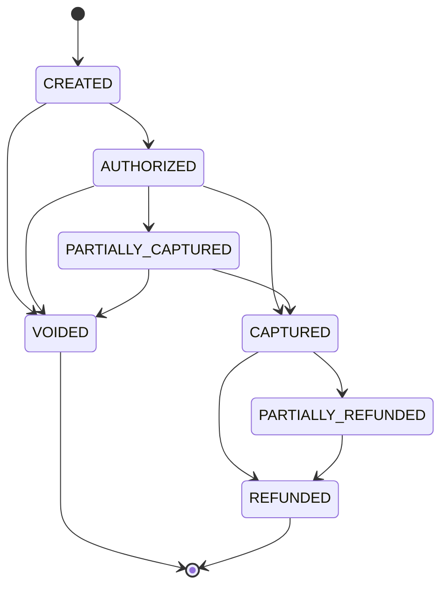

# PayFlow: Payment intent state machine

Transition rules are deterministic; no operation ever picks its target state freely:

| Operation | Legal in state | Resulting state |
|---|---|---|
| `authorize` | `CREATED` | `AUTHORIZED`; `authorized_amount = amount` |
| `capture C` | `AUTHORIZED`, `PARTIALLY_CAPTURED`, with `0 < C ≤ authorized_amount − captured_amount` | `CAPTURED` if cumulative captured equals `authorized_amount`, else `PARTIALLY_CAPTURED` |
| `void` | `CREATED`, `AUTHORIZED`, `PARTIALLY_CAPTURED` | `VOIDED`; remaining hold released |
| `refund R` | `CAPTURED`, `PARTIALLY_REFUNDED`, with `0 < R ≤ captured_amount − refunded_amount` | `REFUNDED` if cumulative refunded equals `captured_amount`, else `PARTIALLY_REFUNDED` |

`VOIDED` and `REFUNDED` are terminal: every operation on a terminal intent is a `409 invalid_state`. There are no other transitions; in particular there is **no dispute/chargeback flow in v1**.
